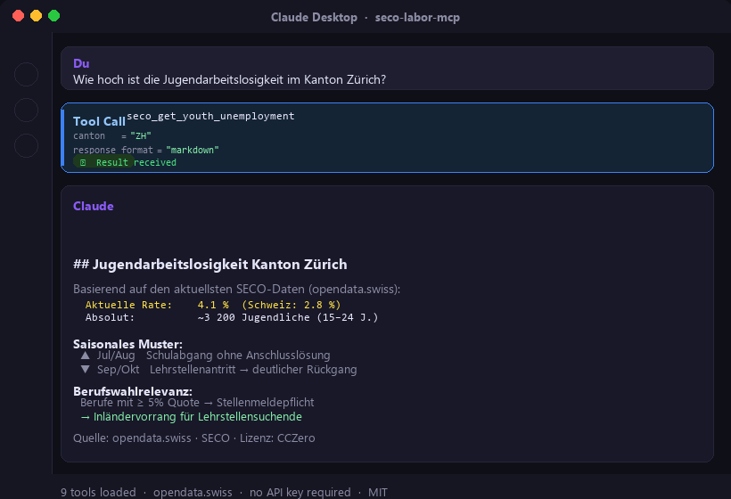

# seco-labor-mcp

> **Swiss Public Data MCP Portfolio** · [malkreide](https://github.com/malkreide)

Ein MCP-Server (Model Context Protocol) für Schweizer Arbeitsmarktdaten des **SECO** (Staatssekretariat für Wirtschaft) und **AMSTAT** via opendata.swiss.

[🇬🇧 English Version](README.md)

<p align="center">
  
</p>

---

## Übersicht

Dieser Server verbindet KI-Modelle mit offiziellen Schweizer Arbeitsmarktstatistiken – ohne API-Schlüssel, ohne Registrierung.

**Primäre Zielgruppen:**
- 🏫 **Schulamt / Bildungsplanung** — Jugendarbeitslosigkeit, Berufswahlberatung
- 📊 **Analyse & Forschung** — Arbeitsmarkttrends, Kantonsvergleiche
- 🤖 **KI-Agenten** — Automatisiertes Monitoring und Reporting

**Anker-Demo-Query:**  
*«Welche Berufsgruppen haben im Kanton Zürich die höchste Jugendarbeitslosigkeit, und welche Lehrberufe unterliegen der Stellenmeldepflicht?»*

---

## Datenquellen (Phase 1 – kein API-Schlüssel nötig)

| Quelle | Beschreibung | Status |
|--------|-------------|--------|
| [opendata.swiss](https://opendata.swiss/de/dataset?q=seco) | CKAN-Katalog mit SECO-CSV-Datensätzen | ✅ Aktiv |
| [arbeit.swiss](https://www.arbeit.swiss) | Monatliche Pressedokumentation (PDF) | ✅ Aktiv |
| [amstat.ch](https://www.amstat.ch) | AMSTAT-Referenzportal | ⚠️ JavaScript SPA |

---

## Tools

| Tool | Beschreibung | Hauptanwendung |
|------|-------------|----------------|
| `seco_search_datasets` | SECO-Datensätze auf opendata.swiss suchen | Datensatz-Discovery |
| `seco_get_dataset` | Vollständige Metadaten und Download-Links | Datenzugang |
| `seco_get_unemployment_overview` | Nationale/kantonale Arbeitslosenzahlen | Überblick |
| `seco_get_youth_unemployment` | Jugendarbeitslosigkeit (15–24 J.) | 🎓 Berufswahlberatung |
| `seco_get_job_seekers` | Stellensuchende (breiter als Arbeitslose) | Weiterbildungsbedarf |
| `seco_get_open_positions` | Offene Stellen als Frühindikator | Branchenanalyse |
| `seco_get_unemployment_by_occupation` | Aufschlüsselung nach Berufshauptgruppe | 🎓 Berufswahl |
| `seco_get_monthly_report_url` | PDF-URL für SECO-Monatsberichte | Quellenverifizierung |
| `seco_list_cantons` | Alle 26 Kantonscodes und -namen | Hilfsfunktion |

---

## Installation

### Claude Desktop (stdio)

Eintrag in `claude_desktop_config.json`:

```json
{
  "mcpServers": {
    "seco-labor": {
      "command": "uvx",
      "args": ["seco-labor-mcp"]
    }
  }
}
```

---

## Schlüsselkonzepte

### Arbeitslose vs. Stellensuchende

> **Eselsbrücke**: Arbeitslose ⊂ Stellensuchende — wie eine russische Matrjoschka.

| Begriff | Definition | Dez. 2025 |
|---------|-----------|-----------|
| Arbeitslose | RAV-gemeldet, sofort vermittelbar | ~149'000 (3.2%) |
| Stellensuchende | Alle RAV-Gemeldeten (inkl. Umschulung) | ~233'900 |

### Saisonalität der Jugendarbeitslosigkeit

- **Juli/August**: Starker Anstieg (Schulabgängerinnen und -abgänger ohne Anschlusslösung)
- **September/Oktober**: Rückgang (Lehrstellenantritt)
- Das verbleibende Residuum nach dem Herbstrückgang zeigt strukturellen Bedarf für **Brückenangebote**

### Stellenmeldepflicht (seit 2020)

Berufsarten mit Arbeitslosenquote ≥ 5% → offene Stellen müssen zuerst dem RAV gemeldet werden. Die Liste ändert sich jährlich. Für die Berufsberatung bedeutet das: Jugendliche in diesen Berufen haben durch Inländervorrang bessere Chancen.

---

## Bekannte Einschränkungen

- `amstat.arbeit.swiss` hat kein öffentliches REST API → Workaround via CKAN
- Kantonsebene-Detaildaten erfordern CSV-Download
- URL-Muster der Monatsberichte kann für ältere Reports abweichen

**Phase 2 (geplant):**
- Automatisches CSV-Caching (24h TTL)
- Direkte XLSX-Verarbeitung für kantonale Aufschlüsselungen
- Integration mit `zh-education-mcp` für Schulamt-spezifische Korrelationen

---

## 🛡️ Sicherheit & Grenzen

| Aspekt | Details |
|--------|---------|
| **Zugriff** | Read-only (`readOnlyHint: true`) — der Server kann keine Daten verändern oder löschen |
| **Personendaten** | Keine Personendaten — alle Quellen sind aggregierte, anonymisierte Statistiken |
| **Rate Limits** | Keine externen Limits; Server begrenzt Abfragen auf 20 Ergebnisse; 30 s HTTP-Timeout |
| **Authentifizierung** | Kein API-Schlüssel erforderlich — opendata.swiss und arbeit.swiss sind öffentlich zugänglich |
| **Lizenzen** | SECO-Daten unter [Creative Commons CCZero](https://creativecommons.org/publicdomain/zero/1.0/) |
| **Nutzungsbedingungen** | Gemäss ToS von: [opendata.swiss](https://opendata.swiss/de/terms-of-use), [SECO](https://www.seco.admin.ch), [arbeit.swiss](https://www.arbeit.swiss) |
| **DSG / DSGVO** | Vollständig konform — keine Personendaten übermittelt oder gespeichert |

---

## Datenlizenz

SECO-Daten auf opendata.swiss stehen unter **Creative Commons CCZero**.  
Quelle: Staatssekretariat für Wirtschaft (SECO) — [seco.admin.ch](https://www.seco.admin.ch)
