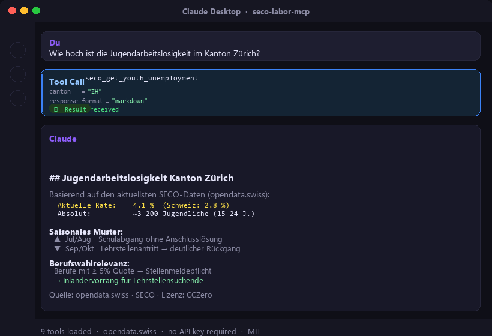

> 🇨🇭 **Teil des [Swiss Public Data MCP Portfolios](https://github.com/malkreide)**

# SECO Labor Market MCP Server


[](https://github.com/malkreide/seco-labor-mcp/actions/workflows/ci.yml)
[](https://pypi.org/project/seco-labor-mcp/)
[](https://www.python.org/)
[](https://modelcontextprotocol.io/)
[](https://github.com/malkreide/seco-labor-mcp)
[](LICENSE)

🌐 **[English](README.md)** | **Deutsch**

Ein MCP-Server (Model Context Protocol) für Schweizer Arbeitsmarktdaten des **SECO** (Staatssekretariat für Wirtschaft) und **AMSTAT** via opendata.swiss.

<p align="center">
  
</p>

---

## Übersicht

Dieser Server verbindet KI-Modelle mit offiziellen Schweizer Arbeitsmarktstatistiken – ohne API-Schlüssel, ohne Registrierung.

**Primäre Zielgruppen:**
- 🏫 **Schulamt / Bildungsplanung** — Jugendarbeitslosigkeit, Berufswahlberatung
- 📊 **Analyse & Forschung** — Arbeitsmarkttrends, Kantonsvergleiche
- 🤖 **KI-Agenten** — Automatisiertes Monitoring und Reporting

**Anker-Demo-Query:**  
*«Welche Berufsgruppen haben im Kanton Zürich die höchste Jugendarbeitslosigkeit, und welche Lehrberufe unterliegen der Stellenmeldepflicht?»*
[→ Weitere Anwendungsbeispiele nach Zielgruppe →](EXAMPLES.md)

---

## Datenquellen (Phase 1 – kein API-Schlüssel nötig)

| Quelle | Beschreibung | Status |
|--------|-------------|--------|
| [opendata.swiss](https://opendata.swiss/de/dataset) | CKAN-Katalog; die gepinnte BFS-Tabelle `T3.3.0.1` trägt die SECO-Jahresreihen | ✅ Aktiv |
| [arbeit.swiss](https://www.arbeit.swiss) | Monatliche Pressedokumentation (PDF) | ✅ Aktiv |
| [amstat.ch](https://www.amstat.ch) | AMSTAT-Referenzportal | ⚠️ JavaScript SPA |
| [unfallstatistik.ch](https://www.unfallstatistik.ch) | Unfallstatistik UVG (SSUV/KSUV c/o Suva) — Berufsunfälle und Berufskrankheiten | ⚠️ Nur PDF, keine API (siehe unten) |

---

## Woher die Zahlen kommen — und was fehlt

**SECO ist auf opendata.swiss kein Herausgeber (mehr).** Geprüft am 2026-08-14:
`organization_show` antwortet 404, und in den 176 Einträgen von
`organization_list` kommt kein SECO vor. Der Server filterte bis dahin jede
Suche auf diese Organisation und lieferte deshalb **nichts** — ein
Namensabgleich, der ins Leere läuft, sieht genau aus wie eine leere Suche.

Die registrierten Arbeitslosen und Stellensuchenden sind trotzdem SECO-Zahlen:
das **BFS veröffentlicht sie** in Tabelle `T3.3.0.1` und nennt SECO in der
Fusszeile als Quelle. Der Server liest diese Tabelle über eine **gepinnte
Datensatz-Kennung** (`sources.py`), die ein Live-Test gegen die Quelle prüft.

| Reihe | 2000 | 2025 |
|---|---|---|
| Registrierte Stellensuchende (SECO) | 124.6 | 214.1 |
| Registrierte Arbeitslose (SECO) | 72.0 | 133.7 |
| Erwerbslose gemäss ILO (BFS) | 126.5 | 248.5 |

*in Tausend, Jahresdurchschnitt*

Die drei Reihen messen **nicht dasselbe**: im Jahr 2000 ist die ILO-Zahl das
1.76-fache der registrierten. Der Server gibt sie getrennt und beschriftet aus
und rechnet sie nie ineinander um.

### Die kantonale Schicht: vier Kantone, vier Schemata

National gibt es keine Monatswerte — **vier Kantone publizieren ihre
RAV-Zahlen aber selbst**, jeder in seinem eigenen Portal mit eigenen
Spaltennamen. Für sie liefert `seco_get_unemployment_overview(canton=…)`
echte Werte:

| Kanton | Granularität | ab | Ebene | Besonderheit |
|---|---|---|---|---|
| **TG** | monatlich | 2016-01 | Kanton | einzige Reihe **nach Altersklasse** → Jugendarbeitslosigkeit als Anzahl |
| **FR** | monatlich | 2004-01 | Kanton **und Schweiz** | führt die Schweizer Monatszahl als Vergleichszeile mit |
| **ZG** | monatlich | 1993-01 | Kanton | Jugendarbeitslosigkeit nur als **Quote**, nicht als Anzahl |
| **ZH** | **jährlich** | 1991 | **Gemeinde** | keine Monatswerte; Bezirke und Regionen stehen in derselben Spalte wie die Gemeinden und werden getrennt |

**Die übrigen 22 Kantone bekommen eine benannte Absage**, keine Zahl aus
einem anderen Kanton und keine national aggregierte. Eine Teilabdeckung, die
sich wie eine vollständige anfühlt, ist schlimmer als gar keine.

Die vier Reihen sind **untereinander nicht vergleichbar** und ergeben addiert
keine Schweizer Zahl: verschiedene Zeitachsen, verschiedene Gebietsebenen,
und im Fall von ZG eine Quote statt einer Anzahl.

**Was es weiterhin nicht gibt:** Arbeitslose nach Berufshauptgruppe, offene
Stellen als nationale Reihe, und Jugendarbeitslosigkeit für die Schweiz oder
für 24 der 26 Kantone. Die betroffenen Werkzeuge sagen das und geben **keine**
Ersatzzahl aus. Interaktiv stehen diese Werte auf
[amstat.ch](https://www.amstat.ch/v2/amstat_de.html); dort gibt es keine
Schnittstelle, die ein Server ansprechen könnte.

---

## Tools

| Tool | Beschreibung | Hauptanwendung |
|------|-------------|----------------|
| `seco_search_datasets` | Arbeitsmarkt-Datensätze auf opendata.swiss suchen (mit Herausgeber je Treffer) | Datensatz-Discovery |
| `seco_get_dataset` | Vollständige Metadaten und Download-Links | Datenzugang |
| `seco_get_unemployment_overview` | Registrierte Arbeitslose: national jährlich, für TG/FR/ZG/ZH kantonal | Überblick |
| `seco_get_youth_unemployment` | Jugendarbeitslosigkeit (15–24 J.) — nur **TG** (Anzahl) und **ZG** (Quote) | 🎓 Berufswahlberatung |
| `seco_get_job_seekers` | Registrierte Stellensuchende, national, Jahresreihe ab 2000 | Weiterbildungsbedarf |
| `seco_get_open_positions` | Offene Stellen als Frühindikator — **keine nationale Reihe verfügbar** | Branchenanalyse |
| `seco_get_unemployment_by_occupation` | Aufschlüsselung nach Berufshauptgruppe — **keine maschinenlesbare Quelle** | 🎓 Berufswahl |
| `seco_get_monthly_report_url` | PDF-URL für SECO-Monatsberichte | Quellenverifizierung |
| `seco_list_cantons` | Alle 26 Kantonscodes und -namen | Hilfsfunktion |
| `seco_get_uvg_overview` | UVG-Schlüsselzahlen zu Berufsunfällen und Berufskrankheiten | Risiko-Überblick |
| `seco_get_uvg_by_branch` | Ergebnisse nach Wirtschaftszweig (NOGA 2008) | 🎓 Berufswahl |
| `seco_get_uvg_trends` | Zehnjahres-Zeitreihe je Branche | Trendanalyse |

12 von maximal 15 Tools.

---

## Unfallstatistik UVG (SSUV)

Die drei `seco_get_uvg_*`-Tools decken die Risikoseite desselben Arbeitsmarkts
ab, den die Arbeitslosen-Tools beschreiben: wie viele Berufsunfälle und
Berufskrankheiten je Branche anfallen und wie sich das über zehn Jahre
entwickelt.

**Herausgeber ist nicht das SECO.** Die Unfallstatistik UVG wird von der
Koordinationsgruppe KSUV und der Sammelstelle SSUV c/o Suva, Luzern
herausgegeben. Das Präfix `seco_` adressiert diesen Server, nicht die Quelle;
jede Response nennt den tatsächlichen Herausgeber im Feld `source`.

### Architektur-Entscheid: C (dump-first)

Live geprüft am 2026-08-05, vollständige Herleitung in
[`PROBE_REPORT_UVG.md`](PROBE_REPORT_UVG.md).

Die Quelle hat **keine API**. Ein Link-Scan über sämtliche Datenseiten ergab
165 PDFs und null Dateien mit `.csv`, `.xlsx` oder `.json`. opendata.swiss kennt
die Quelle nicht (`count=0` bei sechs von sieben Suchbegriffen), und die
BFS-dam-API ignoriert ihre Filterparameter stillschweigend. Übrig bleiben drei
Zugänge, die faktisch maschinenlesbar sind, aber nicht dafür gedacht:

| Zugang | Format | Aktualisierung |
|---|---|---|
| `schluesselzahlen_d.htm` | HTML-Tabelle, 5 Jahre, Gesamtschweiz | jährlich |
| `Ts{YY}.pdf` | Jahresausgabe, Tabellen 1.2 und 2.4 nach NOGA | jährlich, Juni |
| `WirtKl_{BUV\|NBUV}_{NN}.pdf` | Zehnjahres-Reihe je NOGA-Abteilung | jährlich, Januar |

PDFs werden 24 h gecacht und mit Backoff 2s/4s/8s geladen.

### Was jede Response mitliefert

- `source_freshness.data_year` — das **Datenjahr**, nicht das Ausgabejahr. Die
  Ausgabe 2026 weist 2024 aus; dieser Nachlauf von zwei Jahren steht da, statt
  im Kleingedruckten zu verschwinden.
- `totals_check` — die geparsten Zeilen werden summiert und gegen das in
  derselben Publikation gedruckte Total gehalten. Ein gebrochenes Layout fällt
  damit auf, statt zu einer plausibel aussehenden falschen Zahl zu werden.
- `significant` — die Quelle markiert statistisch signifikante Veränderungen
  zum Vorjahr mit einem Stern. Dieses Flag bleibt je Datenpunkt erhalten, damit
  eine Veränderung nur dort als bedeutsam gilt, wo die Quelle das sagt.

---

## Installation

### Claude Desktop (stdio)

Eintrag in `claude_desktop_config.json`:

```json
{
  "mcpServers": {
    "seco-labor": {
      "command": "uvx",
      "args": ["seco-labor-mcp"]
    }
  }
}
```

---

## Schlüsselkonzepte

### Arbeitslose vs. Stellensuchende

> **Eselsbrücke**: Arbeitslose ⊂ Stellensuchende — wie eine russische Matrjoschka.

| Begriff | Definition | Dez. 2025 |
|---------|-----------|-----------|
| Arbeitslose | RAV-gemeldet, sofort vermittelbar | ~149'000 (3.2%) |
| Stellensuchende | Alle RAV-Gemeldeten (inkl. Umschulung) | ~233'900 |

### Saisonalität der Jugendarbeitslosigkeit

- **Juli/August**: Starker Anstieg (Schulabgängerinnen und -abgänger ohne Anschlusslösung)
- **September/Oktober**: Rückgang (Lehrstellenantritt)
- Das verbleibende Residuum nach dem Herbstrückgang zeigt strukturellen Bedarf für **Brückenangebote**

### Stellenmeldepflicht (seit 2020)

Berufsarten mit Arbeitslosenquote ≥ 5% → offene Stellen müssen zuerst dem RAV gemeldet werden. Die Liste ändert sich jährlich. Für die Berufsberatung bedeutet das: Jugendliche in diesen Berufen haben durch Inländervorrang bessere Chancen.

---

## Bekannte Einschränkungen

- `amstat.arbeit.swiss` hat kein öffentliches REST API → Workaround via CKAN
- Kantonsebene-Detaildaten erfordern CSV-Download
- URL-Muster der Monatsberichte kann für ältere Reports abweichen
- UVG-Zahlen stammen aus PDF-Parsing — das Layout war über die Ausgaben 2025
  und 2026 stabil, ein Redesign kann es aber brechen. Der `totals_check` in
  jeder Response ist das, was einen solchen Bruch sichtbar statt still macht.
- UVG-Daten hinken rund zwei Jahre nach (Ausgabe 2026 weist 2024 aus)
- UVG-Branchendetails folgen NOGA 2008 und fassen Abteilungen teilweise
  zusammen (`41 – 42`, `77, 79 – 82`); eine kantonale Gliederung gibt es hier nicht
- Detaildaten jenseits der Publikationen liegen hinter dem CUG-Zugang der SSUV
  und sind für diesen No-Auth-Server ausser Reichweite

**Phase 2 (geplant):**
- Automatisches CSV-Caching (24h TTL)
- Direkte XLSX-Verarbeitung für kantonale Aufschlüsselungen
- Integration mit `zh-education-mcp` für Schulamt-spezifische Korrelationen

---

## Sicherheit & Grenzen

| Aspekt | Details |
|--------|---------|
| **Zugriff** | Read-only (`readOnlyHint: true`) — der Server kann keine Daten verändern oder löschen |
| **Personendaten** | Keine Personendaten — alle Quellen sind aggregierte, anonymisierte Statistiken |
| **Rate Limits** | Keine externen Limits; Server begrenzt Abfragen auf 20 Ergebnisse; 30 s HTTP-Timeout |
| **Authentifizierung** | Kein API-Schlüssel erforderlich — opendata.swiss und arbeit.swiss sind öffentlich zugänglich |
| **Lizenzen** | SECO-Daten unter [Creative Commons CCZero](https://creativecommons.org/publicdomain/zero/1.0/); UVG-Daten **nicht offen lizenziert** (nicht-kommerziell, siehe Datenlizenz) |
| **Nutzungsbedingungen** | Gemäss ToS von: [opendata.swiss](https://opendata.swiss/de/terms-of-use), [SECO](https://www.seco.admin.ch), [arbeit.swiss](https://www.arbeit.swiss) |
| **DSG / DSGVO** | Vollständig konform — keine Personendaten übermittelt oder gespeichert |

---

## Datenlizenz

Es gelten zwei verschiedene Lizenzen. Der Code dieses Servers steht in beiden
Fällen unter MIT — die Daten sind davon nicht gedeckt.

**SECO-/AMSTAT-Daten** auf opendata.swiss stehen unter **Creative Commons CCZero**.
Quelle: Staatssekretariat für Wirtschaft (SECO) — [seco.admin.ch](https://www.seco.admin.ch)

**Daten der Unfallstatistik UVG** sind **nicht** offen lizenziert. Die
Publikation hält fest:

> «Abdruck – ausser für kommerzielle Nutzung – mit Quellenangabe gestattet.»

Das ist eine Nicht-kommerziell-Klausel mit Quellenangabepflicht. Sie gehört
KSUV/SSUV und lässt sich durch die MIT-Lizenz dieses Repos nicht aufheben: MIT
deckt den Code, nicht die Zahlen, die der Code holt. **Wer diesen Server
kommerziell einsetzt, ist für die UVG-Tools nicht abgedeckt** — das ist direkt
mit der Sammelstelle zu klären (`unfallstatistik@suva.ch`). Jede UVG-Response
wiederholt die Einschränkung im Feld `source`, weil ein README dem Modell nicht
weitergereicht wird.

---

## MCP-Protokollversion

Die Protokollversion handelt das SDK beim `initialize`-Handshake aus, dieser
Server wählt sie nicht. Die Revision, gegen die er gebaut und geprüft ist,
lautet **`2025-11-25`** — das ist `LATEST_PROTOCOL_VERSION` in der `mcp`-Version,
die fastmcp hereinzieht.

`tests/test_protocol_version.py` hält drei Dinge gegeneinander: diese Zeile,
jene SDK-Konstante und die Revision, die ein echter Handshake gegen das
Server-Objekt tatsächlich zurückgibt. Ein SDK-Bump, der die Revision ändert,
macht die CI rot, statt lautlos zu driften.

Die Schwester-Server im Portfolio pinnen ein *Paar* von Revisionen — eine
Handshake-Obergrenze und eine moderne —, weil `mcp` 2.x zwei Protokoll-Ären über
denselben Server bedient. fastmcp 3.x pinnt `mcp` 1.x, wo es `mcp.types.version`
nicht gibt und eine Revision die ganze Geschichte ist.
`test_das_sdk_kennt_hier_nur_eine_aera` ist an das SDK gebunden statt an diesen
Absatz und fällt, sobald ein Upgrade die Zwei-Ären-Konstanten hereinzieht.

---

## Mitwirken

Entwicklungsrichtlinien finden Sie in [CONTRIBUTING.md](CONTRIBUTING.md)
([deutsche Version](CONTRIBUTING.de.md)).

---

## Sicherheit

Den Sicherheitsstatus und die Anleitung zum Melden von Schwachstellen finden Sie
in [SECURITY.md](SECURITY.md) ([deutsche Version](SECURITY.de.md)).

---

## Lizenz

Veröffentlicht unter der [MIT-Lizenz](LICENSE) — Copyright © 2026 Hayal Oezkan.

---

## Autor

**Hayal Oezkan** · [github.com/malkreide](https://github.com/malkreide)
